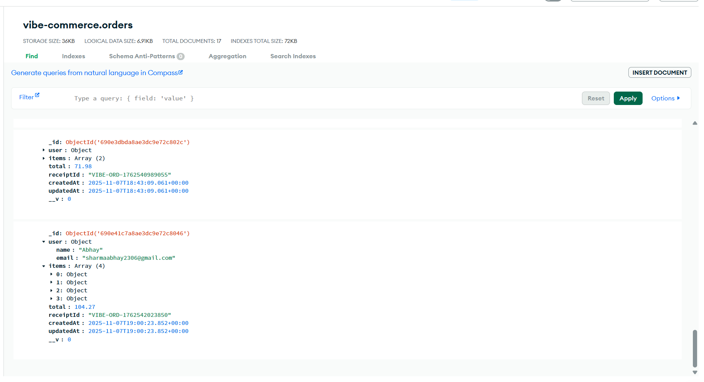

# Vibe Commerce - Full-Stack E-Commerce Cart

This is a full-stack e-commerce cart application built for the Vibe Commerce screening assignment. It features a complete end-to-end user flow, from browsing products on a live third-party API to a persistent, database-driven checkout that saves a full order history.

It is built as a single-page application for a modern, seamless user experience, with the product list and cart always visible.

-----

### 📷 Screenshots



### 📹 Demo Video


-----

## Features

This project fulfills all core requirements and includes several bonus features for a more robust and professional application.

### Core Features

  * **Single-Page Interface:** Products and Cart are displayed side-by-side in a two-column layout for easy access.
  * **Dynamic Cart:** Add or remove items, and the cart (and total) updates instantly via React's Context API.
  * **Checkout Form:** A simple, clean form validates user name and email.
  * **Polished Receipt Modal:** A modal (not an `alert()`) displays a full, correct receipt upon successful checkout.
  * **Responsive Design:** The layout stacks vertically on mobile devices for a clean user experience.

### Bonus Features Implemented

  * **Persistent Database:** Uses **MongoDB Atlas** to store all user cart items. The cart is *not* lost on a page refresh or server restart.
  * **Full Order History:** The checkout process is transactional. It creates a permanent **Order** document in the database, saving the user's details, the items, and the total. This provides a "source of truth" for all completed sales.
  * **Live Third-Party API:** Integrates with the **Fake Store API** to fetch real product data, images, and prices. The backend caches this data on startup to ensure fast response times.
  * **Professional UI/UX:** The UI includes a hero banner, loading spinners, and error-handling messages for a better user experience.

-----

## Tech Stack

  * **Frontend:** React (with Context API for global state)
  * **Backend:** Node.js, Express
  * **Database:** MongoDB (with Mongoose)
  * **API Client:** Axios
  * **Utilities:** `dotenv` (for environment variables), `nodemon` (for development)

-----

## Project Workflow

The application's data flow is designed to be robust and efficient:

1.  **Server Start:** The Node.js server starts, connects to MongoDB, and immediately fetches/caches all products from the Fake Store API.
2.  **App Load:** The React app loads. The `ProductList` component requests `GET /api/products`. The server instantly returns its cached product list.
3.  **Add to Cart:** A user clicks "Add." This calls `addItemToCart` from the `CartContext`, which sends a `POST /api/cart` request to the backend with the `productId`.
4.  **DB Cart:** The backend server finds (or creates) that item in the **MongoDB** `cartitems` collection and updates its quantity.
5.  **State Sync:** The server returns the *entire* updated cart and total. The `CartContext` uses this response to update its state, causing the `CartDisplay` component to re-render in real-time.
6.  **Checkout:** The user submits the checkout form. A `POST /api/checkout` request is sent with the user's name and email.
7.  **Create Order:** The backend:
    a.  Looks up the user's full cart from the `cartitems` collection.
    b.  Creates a new **Order** document in the `orders` collection with the cart items and user data.
    c.  Saves the new order to the database.
    d.  Deletes all items from the `cartitems` collection.
8.  **Success:** The server returns the newly created `Order` object as a receipt. The frontend uses this to display the success modal with the correct receipt ID, total, and timestamp.

-----

## How to Run Locally

**Prerequisites:** [Node.js](https://nodejs.org/) and a [MongoDB Atlas](https://www.mongodb.com/cloud/atlas) account (or a local Mongo instance).

1.  **Clone the repository:**

    ```bash
    git clone https://github.com/[YOUR_USERNAME]/[YOUR_REPO_NAME].git
    cd [YOUR_REPO_NAME]
    ```

2.  **Set up the Backend:**

    ```bash
    # Navigate to the backend folder
    cd backend

    # Install dependencies
    npm install

    # Create a .env file
    touch .env

    # Add your MongoDB connection string to the .env file
    # MONGO_URI=mongodb+srv://...
    ```

3.  **Run the Backend:**

    ```bash
    # Start the server (runs on http://localhost:5001)
    npm start
    ```

4.  **Set up the Frontend (in a new terminal):**

    ```bash
    # Navigate to the frontend folder
    cd frontend

    # Install dependencies
    npm install
    ```

5.  **Run the Frontend:**

    ```bash
    # Start the React app (opens on http://localhost:3000)
    npm start
    ```

-----

## 📄 API Endpoints

  * `GET /api/products`: Get all cached products.
  * `GET /api/cart`: Get all items currently in the database cart.
  * `POST /api/cart`: Add or update an item in the cart. (Body: `{ productId, qty }`)
  * `DELETE /api/cart/:id`: Remove an item (by `productId`) from the cart.
  * `POST /api/checkout`: Process checkout. (Body: `{ user: { name, email } }`)